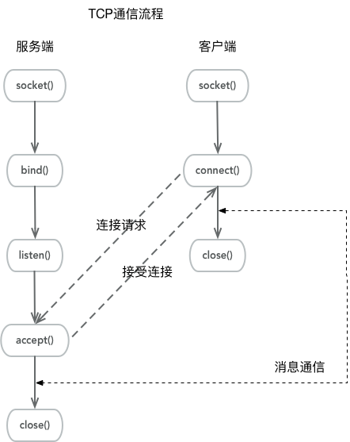

# 网络编程之 `socket` 多端通信
## 回顾
> 在[上一例子](https://github.com/shenyuanluo/NetPrograming/tree/master/TCPDemo/TCPDemo_01)已经了解了与**socket**相关几个基本函数，知道了 `TCP` 连接通信的基本流程：



上一个例子中仅仅是客户端与服务的连接后通信一条消息，这是最简单的 TCP 例子；现在则进一步引入**Pthread**，为客户端单独创建一个接收信息和发送信息的线程，使其可以随时的跟服务端通信。而为服务端单独创建一个与客户单进行通信的线程，负责接收客户的消息的接收以及响应（这里直接回复客户端发来的消息）。

# pthread
> POSIX线程（POSIX threads），简称 `pthreads`，是线程的**POSIX标准**。该标准定义了创建和操纵线程的一整套API。在类Unix操作系统（Unix、Linux、Mac OS X等）中，都使用 pthreads 作为操作系统的线程。

在多线程程序中经常用到的两个函数：`pthread_create()` 和 `pthread_join()`。


## pthread_create
1. **头文件：**`#include<pthread.h>`
2. **功能：**创建线程，在线程成功创建以后，就开始运行相关的线程函数。
3. **原型：**

	``` C
	int pthread_create(pthread_t *tidp, const pthread_attr_t *attr, (void*)(*start_rtn)(void*), void *arg);
	```
4. **参数：**
	- **tidp：**指向线程 ID 的指针。
	- **restrict_attr：**用于指定各种不同的线程属性。
	- **start_rtn：**线程运行函数的起始地址。
	- **arg：**运行函数的参数。如果需要向start_rtn函数传递的参数不止一个，那么需要把这些参数放到一个结构中，然后把这个结构的地址作为 **arg** 的参数传入。
5. **返回值：** 
	- 成功：返回 0。
	- 失败：返回出错编号。
6. **注意：**因为pthread并非Linux系统的默认库，而是 POSIX 线程库。在Linux中将其作为一个库来使用，因此加上 `-lpthread`（或 `-pthread`）以显式链接该库。函数在执行错误时的错误信息将作为返回值返回，**并不修改系统全局变量 `errno`**，所以无法使用perror()打印错误信息。


## pthread_join
1. **头文件：**`#include<pthread.h>`
2. **功能：**以阻塞的方式等待 thread 指定的线程结束。当函数返回时，被等待线程的资源被收回。如果线程已经结束，那么该函数会立即返回。并且 thread 指定的线程必须是**joinable**的。
3. **原型：**

	``` C
	 int pthread_join(pthread_t thread, void **retval);
	```
4. **参数：**
	- **thread：**线程ID，标识唯一线程
	- **retval：**用户定义的指针，用来存储被等待线程的返回值。
5. **返回值：** 
	- 成功：返回 0。
	- 失败：返回出错编号。
6. **注意：**一个线程不能被多个线程等待，也就是说对一个线程只能调用一次 `pthread_join`，否则只有一个能正确返回，其他的将返回 **ESRCH** 错误。

7. **补充：**在Linux中，默认情况下是在一个线程被创建后，必须使用此函数对创建的线程进行资源回收，但是可以设置Threads attributes来设置当一个线程结束时，直接回收此线程所占用的系统资源。

> 在Linux中，新建的线程并不是在原先的进程中，而是系统通过一个系统调用clone()。该系统调用copy了一个和原先进程完全一样的进程，并在这个进程中执行线程函数。不过这个copy过程和fork不一样。 copy后的进程和原先的进程**共享**了所有的变量，运行环境。这样，原先进程中的变量变动在copy后的进程中便能体现出来。